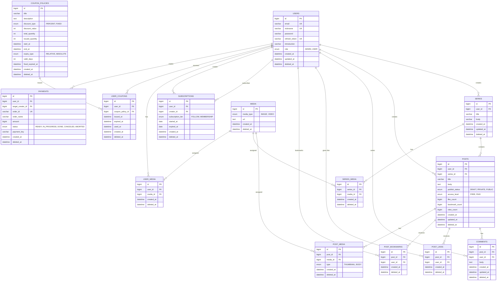

# SCommit (Team 3 - Triple S)

<div align="center">
  <a href="https://www.scommit.store/">
    
  </a>
  <br><br>
  <h3>개발자의 학습을 커밋하다</h3>
  <p>Java → Kotlin 마이그레이션 및 대규모 트래픽/동시성 처리를 위한 아키텍처 고도화 프로젝트</p>
</div>

---

## 🚀 Live Demo

| 서비스                  | URL                                                                                                |
|:---------------------|:---------------------------------------------------------------------------------------------------|
| **SCommit 서비스**      | [https://www.scommit.store](https://www.scommit.store)                                             |
| **API 문서 (Swagger)** | [https://api.scommit.store/swagger-ui/index.html](https://api.scommit.store/swagger-ui/index.html) |

---

## 📝 프로젝트 소개

**이 프로젝트는 기존 자바 프로젝트를 Kotlin으로 마이그레이션하고, 그 과정에서 결제·쿠폰·대시보드·성능 개선 등 다양한 기능을 추가한 프로젝트입니다.**

국내 개발 콘텐츠는 유튜브·벨로그·인프런에 분산되어 있습니다. 창작자는 수익화 도구가 부족하고, 구독자는 흩어진 콘텐츠를 찾아다녀야 합니다. **SCommit**은 이 문제를 해결하는 개발자 특화 지식 구독
플랫폼입니다.

창작자는 포스트를 시리즈(course) 단위로 묶어 발행하고, 포스트마다 공개 범위(`DRAFT` / `PRIVATE` / `PUBLIC`)와 접근 등급(`FREE` / `PAID`)을 독립적으로 설정합니다.
구독자는 창작자를 팔로우(무료)하거나 멤버십(유료)에 가입해 프리미엄 콘텐츠에 접근하고, 새 게시글이 올라오면 SSE 알림을 즉시 받습니다.

---

## 📸 Preview


---

## 주요 기능 (Key Features)

### 1. 포스트 · 시리즈 CRUD

TipTap 리치텍스트 에디터로 글·이미지·동영상을 작성합니다. 포스트는 발행 상태(`DRAFT` 임시저장 / `PRIVATE` 비공개 / `PUBLIC` 공개)와 접근 등급(`FREE` / `PAID`)을 각각
설정할 수 있습니다. 포스트를 시리즈로 묶으면 코스형 학습 콘텐츠로 구성됩니다. 홈은 Slice 기반 무한 스크롤, 창작자 프로필은 Page 기반 번호 페이지네이션으로 조회합니다. 제목·본문 키워드 검색을
지원합니다.

### 2. 구독 등급 기반 접근 제어

구독 상태는 `FOLLOW`(무료 팔로우) · `MEMBERSHIP`(유료 멤버십) 2단계이며, 미구독자는 `NONE`으로 간주합니다. `PAID` 포스트에 `MEMBERSHIP` 구독자가 아닌 유저가 접근하면
서버가 본문을 잠근 부분 응답을 반환하고 클라이언트는 잠금 화면을 표시합니다. `FOLLOW`는 콘텐츠 접근 권한이 아닌 창작자와의 팔로우 관계로, 팔로워 수 집계에 사용됩니다.

### 3. SSE 실시간 알림

포스트 발행·댓글 작성·구독 이벤트가 발생하면 해당 유저에게 알림을 즉시 전달합니다. 클라이언트는 별도 폴링 없이 서버 이벤트를 수신하며, 연결 해제 시 브라우저가 자동 재연결합니다.

### 4. 미디어 업로드

`multipart/form-data`로 파일을 전송하면 백엔드가 Cloudinary에 직접 저장하고, DB에는 URL만 기록합니다. 이미지·동영상 MIME 타입만 허용하며 그 외 파일 형식은 서버에서 거부하고,
prod 환경에서는 단일 파일 100MB · 요청 전체 100MB 제한이 적용됩니다. dev 환경에서는 로컬 파일 시스템(`back/src/main/resources/static/media/`)을 사용합니다.

### 5. 좋아요 · 북마크 · 댓글

포스트에 좋아요와 북마크를 남길 수 있으며, 댓글은 10개 단위 페이지네이션으로 조회합니다. 북마크한 포스트는 마이페이지에서 다시 확인할 수 있습니다. 댓글 작성은 포스트 작성자에게 SSE 알림의 트리거가 됩니다.

### 6. 유저 · 팔로우 시스템

이메일 회원가입·로그인, 프로필 이미지 업로드, 닉네임 검색을 지원합니다. 인증은 HTTP-only 쿠키(`accessToken` + `refreshToken`)로 처리되어 JavaScript에서 토큰에 접근할 수
없습니다. 창작자 프로필 페이지에는 팔로워 수와 발행 포스트 목록이 함께 노출됩니다.

---

## 🔧 마이그레이션 & 개선사항

### Kotlin 마이그레이션
기존 Java 프로젝트를 Kotlin으로 마이그레이션했습니다. 모든 도메인 엔티티, 서비스, 리포지토리, 테스트 클래스가 Kotlin으로 변환되었으며, 이 과정에서 코드 안전성과 간결성이 향상되었습니다.

### 추가된 주요 기능

#### 📊 결제 기능 (Payment)
- 결제 테이블 및 관련 엔티티 추가
- 멤버십 구독 결제 처리 통합
- Flyway V4 마이그레이션으로 스키마 관리

#### 🎟️ 쿠폰 발급 시스템 (Coupon)
- 쿠폰 정책 (할인율, 발급 기간, 사용 기간) 관리
- 비관적 락을 통한 동시성 제어 — 동일 쿠폰에 대한 동시 발급 요청 시 데이터 일관성 보장
- K6 동시성 테스트로 100 VU 동시 발급 검증
- E2E 테스트로 발급·사용·만료 시나리오 검증

#### 📈 통계 대시보드 (Dashboard)
- **Admin 대시보드**: 플랫폼 전체 통계 (총 사용자, 구독자, 게시글, 수익 등)
- **Creator 대시보드**: 창작자별 콘텐츠 성과 (조회수, 좋아요, 구독자, 수익 등)
- 롤 기반 접근 제어

#### ✅ E2E 테스트 확대
- Like, Bookmark, Comment, Notification, Coupon, Subscription 등 도메인별 E2E 테스트 추가
- 실제 API 엔드포인트 호출로 기능 검증

#### 🗂️ Flyway 마이그레이션 관리
- 스키마 버전 관리 (V1: 초기 스키마, V2: 인덱스 최적화, V3: NOT NULL 제약 추가, V4: 결제 테이블)
- 반복 가능한 마이그레이션으로 데이터베이스 변경 이력 관리

#### 🚀 무중단 배포 (Blue-Green Deployment)
- 기존 서버(Blue)와 신규 서버(Green) 동시 운영
- 헬스체크 기반 자동 전환
- 배포 중 서비스 다운타임 0 달성

#### 🏗️ Terraform 도입
- AWS 인프라 코드화 (IaC)
- EC2, RDS, 보안 그룹 등 리소스 자동 프로비저닝
- 재현 가능하고 버전 관리되는 인프라 구성

---

## 기술 하이라이트 (Tech Highlights)

### SSE로 구현한 실시간 알림

HTTP 폴링이나 WebSocket 대신 SSE를 선택했습니다. 알림은 서버→클라이언트 단방향 이벤트로 충분하고, SSE는 HTTP 기반이라 별도 프로토콜 업그레이드 없이 Spring MVC `SseEmitter`로
바로 구현할 수 있습니다. 유저 ID를 키로 `SseEmitter`를 `SseEmitterRepository`에 보관하고, 포스트 발행(`PostService`) · 댓글(`CommentService`) · 구독(
`SubscriptionService`) 이벤트 발생 시 서비스 레이어에서 즉시 푸시합니다. 연결은 30분 타임아웃 후 자동 해제되며, 클라이언트 재연결은 브라우저가 처리합니다.

### HTTP-only 쿠키 JWT 인증 + 구독 등급 접근 제어

세션리스 아키텍처를 위해 JWT를 선택했습니다. 토큰은 `accessToken` + `refreshToken`을 HTTP-only 쿠키에 담아 발급해 JavaScript에서 접근할 수 없도록 XSS 경로의 토큰
탈취를 방지합니다. 포스트마다 `PostAccessLevel(FREE/PAID)`을 설정하고, Spring Security 필터가 쿠키의 JWT로 유저를 인증한 뒤 `PostService`가
`SubscriptionTier`를 조회해 `PAID` 포스트 본문 노출 여부를 결정합니다.

### Cloudinary CDN 미디어 파이프라인

이미지·동영상을 애플리케이션 서버에 두지 않고 Cloudinary CDN에 직접 저장합니다. 백엔드는 업로드 후 반환된 URL만 DB에 기록하며 서버 디스크 I/O가 없습니다. dev 환경은 로컬 파일 서비스로
대체해 Cloudinary 계정 없이 개발할 수 있습니다. 프로파일(`dev` / `prod`)로 미디어 서비스 구현체를 교체합니다.

### 풀 모니터링 스택 구축 (EC2 2-tier 분리)

앱 EC2와 모니터링 EC2를 분리해 운영 부하가 관측 시스템에 영향을 주지 않도록 구성했습니다.

- **앱 EC2**: Spring Boot 앱 · MySQL · **Promtail**(컨테이너 로그 수집 후 Loki로 푸시) · **MySQL Exporter**(DB 메트릭 노출)
- **모니터링 EC2**: **Prometheus**(메트릭 수집) · **Grafana**(대시보드) · **Loki**(로그 집계) · **Node Exporter**(OS 메트릭)

Spring Actuator의 `/actuator/prometheus` 엔드포인트로 JVM 메모리·GC·HikariCP 커넥션 풀·HTTP 요청 p95/p99 레이턴시를 수집하고, 애플리케이션·OS·DB·로그를 단일
Grafana 대시보드에서 확인합니다.

### JaCoCo 커버리지 게이트

라인 커버리지 80%, 브랜치 커버리지 70% 기준을 JaCoCo로 설정해 CI에서 자동으로 강제합니다. 기준 미달 시 빌드가 실패하므로 테스트 없는 코드는 `main`에 머지될 수 없습니다. 현재 275개 단위
테스트로 전체 라인 커버리지 76%를 달성했습니다.

---

## 기술 스택 (Tech Stack)

### Backend


### Frontend


### Infra & DevOps


### Monitoring & Testing


### Collaboration


---

## 협업 방식

### Jira + GitHub 기반 개발 워크플로우

**이슈 추적 & 브랜치 전략**
- Jira (`TRIPLES-XX`)로 기능·버그·개선사항을 우선순위와 함께 정리
- 브랜치 생성 시 이슈 번호를 포함: `feat/TRIPLES-XX-description` 또는 `fix/TRIPLES-XX-description`
- 각 브랜치는 **한 가지 기능/버그 수정**에만 집중 (단일 책임 원칙)

### 커밋 메시지 컨벤션 (Conventional Commits)

```
<type>: <subject>

<body>

<footer>
```

**타입:**
- `feat`: 새로운 기능 추가
- `fix`: 버그 수정
- `refactor`: 코드 리팩토링 (기능 변경 없음)
- `perf`: 성능 개선
- `test`: 테스트 코드 추가/수정
- `docs`: 문서 변경
- `style`: 코드 스타일 (포맷팅, 세미콜론 등)
- `chore`: 빌드, 의존성 업데이트 등

**예시:**
```
feat: N+1 쿼리 배치 조회로 최적화

좋아요 목록 조회 시 배치 조회를 적용하여 DB 쿼리 수 감소.
- Query 개수: 1 + n → 2로 개선
- p95 레이턴시: 350ms → 280ms 개선

TRIPLES-35
```

### PR 검증 & 머지 정책

**PR 생성 시 체크리스트:**
1. 브랜치가 `main`의 최신 commit 기반인가? → `git rebase main`
2. 테스트를 작성했는가? (JaCoCo 커버리지 충족)
3. 코드 스타일을 확인했는가? (ktlint, Detekt 통과)

**PR 검증 프로세스:**
1. **CI 자동 검증** (GitHub Actions)
   - JUnit5 단위 테스트 + JaCoCo 커버리지 (80% 라인, 70% 브랜치)
   - 실패 시 merge 불가

2. **AI 코드 리뷰** (Gemini 2.5 Flash)
   - 자동으로 P1 (Critical) / P2 (Major) / P3 (Minor) 등급 인라인 코멘트 작성
   - 기존 리뷰는 덮어써 중복 방지

3. **인간 코드 리뷰**
   - 팀원 최소 1명 이상 승인 필수
   - 변경 범위가 크거나 복잡하면 2명 이상 검토

**머지 정책:**
- **main 브랜치는 protected branch** (직접 push 불가)
- PR 승인 후 "Squash and merge" 방식으로 commit 히스토리 정리
- PR 제목이 커밋 메시지가 되므로 명확하게 작성

```
[예] feat: 좋아요 목록 조회 N+1 최적화
```

### 코드 리뷰 포인트

**인간 리뷰에서 중점:**
- **정확성**: 비즈니스 로직이 올바르게 구현되었는가?
- **테스트**: 엣지 케이스를 충분히 테스트했는가?
- **동시성**: 동시 요청 시 데이터 일관성이 보장되는가?
- **성능**: N+1 쿼리, 불필요한 반복문이 없는가?
- **보안**: 입력 검증, 인증/인가 체크가 있는가?
- **가독성**: 변수명, 함수명이 명확한가?

**AI 리뷰 자동 검출 (Gemini):**
- 중복 코드
- 예외 처리 누락
- 타입 안전성 문제
- 성능 안티패턴

---

## 성능 테스트 (K6)

`performance/`(정상 부하)와 `stress/`(한계 부하) 두 세트로 포스트 조회 3종·좋아요 2종 시나리오를 구성했습니다. 아래는 프로덕션 서버(`api.scommit.store`)에서 측정한 주요 결과입니다.

| 시나리오 | 내용 | VU | p(95) | 에러율 | 처리량 |
|:---|:---|:---:|:---:|:---:|:---:|
| **로그인 유저 순차 조회** | JWT 인증 + 개인화 쿼리 포함, 1~100번 포스트 순회 | 100 | **158ms** | 0% | 28 req/s |
| **동시 좋아요** | 100명이 동일 포스트에 동시 INSERT 경합 | 100 | **268ms** | 0% | 28 req/s |
| **쿠폰 동시 발급** | 100명이 동일 쿠폰에 동시 발급 (비관적 락) | 100 | **312ms** | 0% | 26 req/s |

> 동일 100 VU 조건에서 비로그인 조회와 JWT 로그인 조회의 p95 차이는 **3ms 미만**으로, Spring Security 인증 필터 오버헤드가 사실상 0에 수렴합니다.  
> 동시 좋아요 시나리오는 HikariCP 기본 풀(10개)만으로 100 VU 동시 쓰기 경합을 처리했습니다.  
> 쿠폰 발급은 비관적 락으로 동시 요청 시에도 데이터 일관성을 보장하면서 안정적인 처리량을 유지합니다.


---

## CI/CD (GitHub Actions)

3개의 워크플로우로 코드 품질 검증, 자동 배포, AI 코드 리뷰를 처리합니다.

### CI — 테스트 & 커버리지 검증 (`ci.yml`)

`main` 브랜치에 push 또는 PR이 열릴 때마다 실행됩니다.

1. JDK 25 Temurin 설치
2. `./gradlew check` — JUnit5 단위 테스트 + JaCoCo 커버리지 검증 (라인 80% · 브랜치 70% 미달 시 빌드 실패)
3. JaCoCo HTML 리포트를 GitHub Actions 아티팩트로 업로드

### CD — 빌드 & 배포 (`cd.yml`)

`main`에 push될 때 백엔드 관련 파일(`back/**`, `docker-compose.yml`, `promtail-config.yml`)이 변경된 경우에만 실행됩니다. 프론트엔드 변경은 Vercel이 자동
처리합니다.

1. Docker Buildx로 이미지 빌드 (GHA 레이어 캐시 사용)
2. GHCR(`ghcr.io/prgrms-be-devcourse/nbe10-12-3-team3:latest`)에 이미지 푸시
3. SCP로 `docker-compose.yml`, `promtail-config.yml`을 EC2로 전송
4. EC2 SSH 접속 → `.env` 파일 생성 → `mysql-exporter.cnf` 생성 → `docker compose pull` + `docker compose up -d`

### Terraform — 인프라 배포 (`terraform.yml`)

Terraform으로 AWS 인프라 프로비저닝을 자동화합니다.

1. Terraform 초기화 및 검증
2. 변경사항 계획 (plan)
3. 수동 승인 후 적용 (apply)

### AI 코드 리뷰 (`code-review.yml`)

`main` 대상 PR이 열리거나 업데이트될 때마다 실행됩니다. (초안 PR 제외)

- `*.lock`, `*.svg` 등을 제외한 diff를 **Gemini 2.5 Flash**에 전달
- **P1 (Critical) / P2 (Major) / P3 (Minor)** 등급으로 분류된 인라인 코멘트와 요약 코멘트를 PR에 자동 게시
- 동일 PR의 기존 리뷰 코멘트는 덮어써 중복 게시를 방지

```
[Push to main]
      │
      ├─ CI ──▶ JUnit5 테스트 + JaCoCo 커버리지 검증
      │
      ├─ CD ──▶ Docker 빌드 ──▶ GHCR 푸시 ──▶ EC2 배포 (백엔드 변경 시에만)
      │
      ├─ Terraform ──▶ AWS 인프라 프로비저닝
      │
      └─ Vercel ─▶ 프론트엔드 자동 배포

[PR to main]
      └─ AI Code Review ──▶ Gemini 2.5 Flash ──▶ P1/P2/P3 인라인 코멘트
```

---

## 시스템 구성도 (Architecture)


---

## 데이터베이스 스키마 (ERD)



---

## 🛠 시작하기 (Getting Started)

로컬 개발 환경은 H2 파일 기반 데이터베이스를 사용합니다. DB를 별도로 설치하지 않아도 됩니다.

### 1. 환경변수 준비

| 변수               | 용도                        |
|:-----------------|:--------------------------|
| `JWT_SECRET_KEY` | JWT 서명 비밀키 (256bit 이상 권장) |

> dev 프로파일이 기본값으로 적용됩니다. H2 파일 DB(`./back/triples`)와 로컬 미디어 저장소를 사용하므로 DB 인증 정보나 Cloudinary 키는 필요하지 않습니다.

### 2. 백엔드 실행

```bash
cd back
JWT_SECRET_KEY=your-secret-key ./gradlew bootRun
```

### 3. 프론트엔드 실행

```bash
cd front
pnpm install
pnpm dev
```

| 엔드포인트      | URL                                         |
|:-----------|:--------------------------------------------|
| 서비스        | http://localhost:3000                       |
| Swagger UI | http://localhost:8080/swagger-ui/index.html |
| H2 콘솔      | http://localhost:8080/h2-console            |

### 테스트 및 커버리지

```bash
# 단위 테스트 실행 + JaCoCo 리포트 생성
cd back && ./gradlew test

# 커버리지 리포트 확인
open back/build/reports/jacoco/test/html/index.html
```

---

## 프로젝트 구조 (Project Structure)

### Backend Structure (Kotlin + Spring Boot)

```
back/
├── src/main/kotlin/com/scommit/
│   ├── domain/                 # 도메인 주도 설계 (DDD)
│   │   ├── user/              # 유저 도메인 (user, usermedia)
│   │   ├── post/              # 포스트 도메인 (post, like, bookmark, comment, postmedia)
│   │   ├── series/            # 시리즈 도메인 (series, seriesmedia)
│   │   ├── subscription/      # 구독 도메인 (tier: FOLLOW, MEMBERSHIP)
│   │   ├── notification/      # SSE 실시간 알림 도메인
│   │   ├── media/             # 미디어 공통 도메인 (Cloudinary CDN 통합)
│   │   ├── payment/           # 결제 도메인 (토스 결제 연동)
│   │   ├── coupon/            # 쿠폰 도메인 (비관적 락 동시성 제어)
│   │   │   ├── couponpolicy/  # 쿠폰 정책 관리
│   │   │   └── usercoupon/    # 사용자 쿠폰 발급/사용
│   │   └── dashboard/         # 통계 대시보드 도메인
│   │       ├── admin/         # 플랫폼 관리자 통계 (전체 사용자, 수익 등)
│   │       └── creator/       # 창작자 대시보드 (조회수, 구독자, 수익 등)
│   │
│   └── global/
│       ├── config/            # 전역 설정 (Security, JPA, Swagger 등)
│       ├── security/          # JWT 필터, 인증/인가, @AuthenticationPrincipal
│       ├── exception/         # 전역 예외 처리 (ErrorResponse)
│       ├── dto/               # 공통 응답 객체
│       ├── base/              # BaseEntity 등 공통 추상 클래스
│       └── init/              # 초기 데이터 설정
│
├── src/main/resources/
│   ├── application.yml        # 기본 설정 (dev 프로파일 기본값)
│   ├── application-dev.yml    # dev 환경 설정 (H2 인메모리 DB)
│   ├── application-prod.yml   # 프로덕션 설정 (MySQL)
│   ├── application-test.yml   # 테스트 환경 설정 (H2 테스트 DB)
│   ├── db/migration/          # Flyway DB 마이그레이션
│   │   ├── V1__init.sql       # 초기 스키마 (14개 테이블)
│   │   ├── V2__reorder_like_bookmark_unique_index.sql
│   │   ├── V3__enforce_not_null_user_id.sql
│   │   └── V4__add_payments_table.sql
│   └── static/media/          # dev 환경 로컬 미디어 저장소
│
└── src/test/kotlin/           # 테스트 코드 (JUnit5)
    └── com/scommit/
        ├── domain/            # 각 도메인별 단위 & 통합 테스트
        │   ├── user/          # User 관련 테스트
        │   ├── post/          # Post, Like, Bookmark, Comment 테스트
        │   ├── series/        # Series 테스트
        │   ├── subscription/  # Subscription 테스트
        │   ├── payment/       # Payment 테스트
        │   ├── coupon/        # Coupon 정책 & 발급 테스트 (동시성 제어)
        │   ├── dashboard/     # Dashboard 서비스 테스트
        │   ├── media/         # Media 서비스 테스트
        │   └── notification/  # Notification 테스트
        └── global/
            ├── security/      # JWT 필터 & 보안 테스트
            └── e2e/           # API 엔드포인트 E2E 테스트
```

### Frontend Structure (Next.js 16 + React 19 + TypeScript)

```
front/
├── src/
│   ├── app/                      # Next.js App Router 페이지 (SSR)
│   │   ├── (auth)/              # 인증 레이아웃
│   │   │   ├── login/           # 로그인 페이지
│   │   │   └── signup/          # 회원가입 페이지
│   │   ├── posts/               # 게시글 관련 페이지
│   │   │   ├── [id]/            # 게시글 상세 조회
│   │   │   ├── [id]/edit/       # 게시글 수정
│   │   │   └── create/          # 게시글 작성
│   │   ├── series/              # 시리즈 관련 페이지
│   │   │   └── [id]/            # 시리즈 상세 페이지
│   │   ├── users/               # 유저 프로필 페이지
│   │   ├── admin/               # 관리자 대시보드 (롤 기반 접근)
│   │   ├── creator/             # 창작자 대시보드 (본인 통계)
│   │   ├── mypage/              # 마이페이지 (프로필, 설정)
│   │   ├── bookmarks/           # 북마크한 게시글 목록
│   │   ├── search/              # 검색 페이지
│   │   ├── layout.tsx           # 루트 레이아웃
│   │   └── page.tsx             # 홈 페이지
│   │
│   ├── components/              # 재사용 가능한 React 컴포넌트
│   │   ├── ui/                  # 기본 UI 컴포넌트 (Button, Card, Modal 등)
│   │   ├── dashboard/           # 대시보드 컴포넌트
│   │   │   ├── admin-dashboard-view.tsx
│   │   │   └── creator-dashboard-view.tsx
│   │   ├── common/              # 공통 레이아웃 (Header, Sidebar, Footer)
│   │   ├── editor/              # TipTap 리치텍스트 에디터
│   │   ├── post/                # 포스트 관련 컴포넌트
│   │   ├── series/              # 시리즈 관련 컴포넌트
│   │   ├── comment/             # 댓글 컴포넌트
│   │   └── mypage/              # 마이페이지 컴포넌트
│   │
│   ├── hooks/                   # 커스텀 React 훅
│   │   └── useAuth.ts           # 인증 상태 관리
│   │
│   ├── lib/                     # 유틸리티 및 API 클라이언트
│   │   ├── api.ts               # Axios 인스턴스
│   │   ├── dashboard-api.ts     # 대시보드 API 클라이언트
│   │   └── utils/               # 헬퍼 함수
│   │
│   └── providers/               # React Context & Providers
│       └── AuthProvider.tsx     # 인증 상태 전역 관리
│
├── next.config.ts              # Next.js 설정 (Tailwind, 최적화)
├── tailwind.config.ts          # Tailwind CSS v4 설정
├── tsconfig.json               # TypeScript 설정
└── package.json                # 의존성 & 스크립트
```

---

## 팀원 (Team)

| 이름  | 역할 | GitHub |
|:----|:---|:---|
| 남효림 | Kotlin 마이그레이션(User, Comment, Media, Like, Bookmark, Security), E2E 테스트 | [](https://github.com/EuniceNam) |
| 오준서 | Kotlin 마이그레이션(SSE, Series, Global), 좋아요 성능 개선, Flyway, 무중단 배포/Terraform, 통계 대시보드 | [](https://github.com/piker0925) |
| 최선진 | Kotlin 마이그레이션(Subscription), 결제 기능, E2E 테스트| [](https://github.com/Ant1Ch3aT) |
| 한철완 | Kotlin 마이그레이션(Post), 쿠폰 발급 기능, E2E 테스트, K6 쿠폰 동시성 테스트 | [](https://github.com/Mungwani) |
